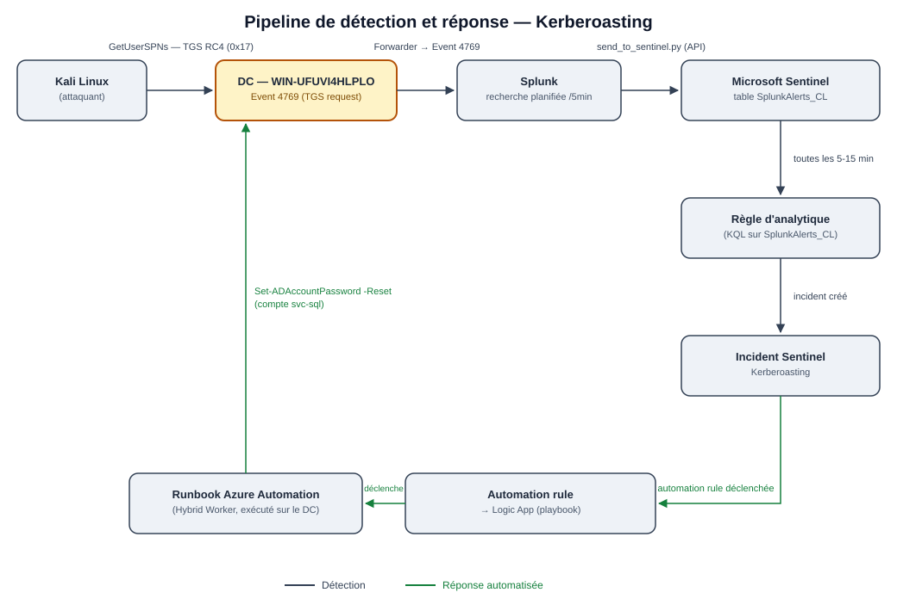

# 🛡️ Projet SOC — Kerberoasting : détection, remontée Sentinel, réponse automatique

L’objectif n’est pas de « casser Kerberos ». C’est de montrer une **chaîne SOC complète** : simulation d’un Kerberoasting, détection Splunk, incident Sentinel, remédiation automatique dans Active Directory **sans interrompre le service**.

**Compétences démontrées :** ingénierie de détection avec SPL, intégration SIEM → SOAR entre deux outils sans connecteur natif, réponse automatisée sans interruption de service, et hygiène des secrets.

---

## Table des matières

1. [De quoi il s'agit](#-de-quoi-il-sagit)
2. [Stack technique](#-stack-technique)
3. [Architecture](#-architecture)
4. [Attaque simulée](#-attaque-simulée)
5. [Détection (SPL + MITRE)](#-détection)
6. [Remontée vers Sentinel](#-remontée-vers-sentinel)
7. [Réponse automatisée](#-réponse-automatisée)
8. [Vérification](#-vérification)
9. [Problèmes rencontrés et solutions](#-problèmes-rencontrés-et-solutions)
10. [Pistes d'amélioration](#-pistes-damélioration)
11. [Résumé](#-résumé)

---

## 📌 De quoi il s'agit

Un utilisateur du domaine (même peu privilégié) peut demander un ticket de service (TGS) pour n’importe quel compte qui a un **SPN**. Le KDC chiffre ce ticket avec la clé du compte de service. Si le ticket est en **RC4**, l’attaquant emporte un hash et peut le craquer **hors ligne**.

Côté SOC, il n’y a **pas d’échec de logon** (pas d’Event **4625**). Le signal, c’est la **demande de TGS** (Event **4769**).

**Réponse retenue :** ne pas désactiver `svc-sql` (compte applicatif). **Réinitialiser le mot de passe** (20 caractères aléatoires) pour invalider les hash déjà volés, puis synchroniser vers Entra ID.

```
Attaque (TGS RC4) → Splunk (4769 / 0x17) → SplunkAlerts_CL → Incident Sentinel → Playbook → Reset MDP sur le DC
```

### MITRE ATT&CK

| Champ | Valeur |
|-------|--------|
| Technique | **[T1558.003 — Kerberoasting](https://attack.mitre.org/techniques/T1558/003/)** |
| Tactique | Credential Access |

---

## 🧰 Stack technique

| Composant | Rôle |
|-----------|------|
| **Active Directory** `Mars.local.com` | Comptes de service (SPN) |
| **DC** `WIN-UFUVI4HLPLO` (`192.168.1.100`) | KDC, journal Security, Hybrid Worker |
| **Kali Linux** | Attaque (`impacket-GetUserSPNs`) |
| **Splunk Enterprise** | Détection (recherche planifiée + script d’action) |
| **Script Python** | Envoi vers Log Analytics (API Data Collector, HMAC-SHA256) |
| **Microsoft Sentinel** | Table `SplunkAlerts_CL` → incident → playbook |
| **Azure Automation** | Runbook PowerShell exécuté **sur le DC** |
| **Entra Connect** | Synchro du compte après le reset |

**Compte de test :** `svc-sql`

**Résultat d’attaque (lab) :** environ **50** hash `$krb5tgs$23$` (etype 23 = RC4-HMAC)

---

## 🗺️ Architecture

Splunk détecte. Sentinel orchestre. Le Hybrid Worker exécute la remédiation **localement sur le DC**.

Splunk voit les événements Windows du lab. Sentinel orchestre l’incident et le playbook (comme sur le scénario brute force). On ne recopie pas tout le journal Security dans Azure : on remonte **l’alerte déjà filtrée** dans une table custom, `SplunkAlerts_CL`.

Le playbook ne peut pas toucher l’AD depuis le cloud : un **Hybrid Worker** sur le DC exécute le runbook en local.

### Chaîne détaillée

| Étape | Composant | Action |
|-------|-----------|--------|
| 1 | Kali + Impacket | Demande de TGS (`GetUserSPNs -request`) |
| 2 | DC / KDC | Event **4769**, chiffrement **0x17** (RC4) |
| 3 | Splunk | Recherche planifiée + alerte |
| 4 | `send_to_sentinel.py` | Envoi HMAC-SHA256 vers l’API Data Collector |
| 5 | Sentinel | Table `SplunkAlerts_CL` → règle → incident |
| 6 | Logic App | Playbook, entité = compte de **service** |
| 7 | Hybrid Worker | Runbook sur le DC |
| 8 | PowerShell | `Set-ADAccountPassword` (20 caractères) |
| 9 | Entra Connect | `Start-ADSyncSyncCycle -PolicyType Delta` |



---

## 💥 Attaque simulée

Simulation d’une demande de TGS avec Impacket jusqu’à l’obtention des hash RC4. **Le lab s’arrête avant tout cassage hors ligne.**

Outil retenu : **Impacket** (`impacket-GetUserSPNs`). NetExec (`nxc --kerberoasting`) n’était pas fiable dans ce lab (voir [problèmes](#-problèmes-rencontrés-et-solutions)).

```bash
impacket-GetUserSPNs 'Mars.local.com/<utilisateur>:<mot_de_passe>' \
  -dc-ip 192.168.1.100 -request

impacket-GetUserSPNs 'Mars.local.com/<utilisateur>:<mot_de_passe>' \
  -dc-ip 192.168.1.100 -request-user svc-sql
```

Résultat : tickets au format `$krb5tgs$23$...`, exploitables hors ligne. L’enjeu du lab, c’est la **détection / réponse**, pas le cracking.


---

## 🔍 Détection

Filtrage des événements **4769** sur le chiffrement **0x17** (RC4). On ignore `krbtgt` et les comptes machine (`$`).

Cette sous-catégorie d’audit (**Opérations de ticket du service Kerberos**) est **désactivée par défaut**. Un `auditpol` local ne suffit pas : la GPO des DC l’écrase au refresh. Il faut l’activer **dans la GPO**.

Recherche Splunk planifiée : extraction du demandeur, du service, de l’IP et du type de chiffrement.

```spl
index=* sourcetype="WinEventLog:Security" EventCode=4769
| rex field=_raw "Account Name:\s+(?<requester>[^\r\n\t]+)"
| rex field=_raw "Service Name:\s+(?<service>[^\r\n\t]+)"
| rex field=_raw "Client Address:\s+(?<src_ip>[^\r\n\t]+)"
| rex field=_raw "(?i)(Ticket Encryption Type|Type de chiffrement[^:\r\n]*):\s*(?<enc_type>0x[0-9A-Fa-f]+)"
| eval requester=trim(requester), service=trim(service), enc_type=lower(enc_type)
| where enc_type="0x17"
| where requester!="krbtgt" AND service!="krbtgt"
| where NOT match(requester, "\\$$") AND NOT match(service, "\\$$")
| table _time requester service src_ip enc_type
```


---

## 📡 Remontée vers Sentinel

Pas de connecteur Splunk → Sentinel. Contournement : un script d’action Splunk passe les résultats à `send_to_sentinel.py`, qui les envoie vers l’**API HTTP Data Collector** avec une signature **HMAC-SHA256** (clé du workspace — **pas dans le dépôt**). Les événements arrivent dans la table custom `SplunkAlerts_CL`.

Chaîne Sentinel : règle d’analytique → incident → automation rule → Logic App.

L’entité visée par le runbook est le **compte de service** (`svc-sql`), pas le compte qui a demandé le TGS.

[Script d’action Splunk / configuration de l’envoi vers Sentinel](./send_to_sentinel.py)


---

## 🤖 Réponse automatisée

Désactiver `svc-sql` casserait l’application. Le runbook **change le mot de passe** (aléatoire, 20 caractères) et lance une synchro Entra Connect. Les TGS déjà extraits ne correspondent plus à la clé du compte.

### Le playbook (Logic App)

Sentinel se contente de préparer la donnée : toute la logique de remédiation est déléguée à Azure Automation. Le playbook est volontairement minimal — **4 étapes**, aucune logique métier côté Logic App.


| Étape | Action | Rôle |
|-------|--------|------|
| 1 | **Microsoft Sentinel incident** | Déclencheur : démarre à la création de l'incident généré par la règle d'analytique Kerberoasting |
| 2 | **Entities - Get Accounts** | Récupère les entités de type Account attachées à l'incident |
| 3 | **For each** | Boucle sur chaque compte remonté par l'étape précédente |
| 4 | **Create job (Azure Automation)** | Crée un job pour le runbook de reset, avec le compte en paramètre |


**Point d'attention :** la règle d'analytique mappe à la fois le compte attaquant (`account_s`) et le compte de service ciblé (`service_name_s`) sur l'entité Account. En l'état, **Entities - Get Accounts** ne distingue pas les deux : sans filtre entre cette étape et le **For each**, le playbook peut déclencher un job de reset sur les **deux comptes** plutôt que sur le seul compte de service. À vérifier dans les logs d'exécution, ou à corriger via une condition sur le nom du compte avant **Create job**.


Le code tourne sur le DC via le Hybrid Worker.

```powershell
param(
    [Parameter(Mandatory = $true)]
    [string]$AccountName
)

Import-Module ActiveDirectory

Add-Type -AssemblyName System.Web
$newPassword = [System.Web.Security.Membership]::GeneratePassword(20, 4)
$securePassword = ConvertTo-SecureString $newPassword -AsPlainText -Force

Set-ADAccountPassword -Identity $AccountName -NewPassword $securePassword -Reset

try {
    Import-Module ADSync
    Start-ADSyncSyncCycle -PolicyType Delta
}
catch {
    Write-Output $_
}
```


---

## ✅ Vérification

Incident créé, playbook réussi.


        

Côté AD : `PasswordLastSet` à jour, compte **toujours activé**.

```powershell
Get-ADUser svc-sql -Properties PasswordLastSet, Enabled |
    Select-Object SamAccountName, Enabled, PasswordLastSet
```

Côté journal : Event **4724** (réinitialisation de mot de passe). Le **Sujet** doit être le **compte machine du DC**, pas un administrateur : c’est la preuve que c’est le Hybrid Worker local qui a agi.


---

## 🧩 Problèmes rencontrés et solutions

Rien n’a marché du premier coup. Voici ce qui a vraiment bloqué.

### Problème 1 — Silence total : 0 Event 4769

**Symptôme :** Aucun événement 4769 dans le journal Security.

**Cause :** L’audit « Opérations de ticket du service Kerberos » est **off par défaut**. Un `auditpol` local est **écrasé** par la Default Domain Controllers Policy.

**Solution :** Activation **dans la GPO**, pas en local.


---

### Problème 2 — `nxc --kerberoasting` instable

**Symptôme :** Crash silencieux, puis erreur Python (nxc / Python 3.13 + `--verbose`).

**Cause :** DNS realm + horloge Kali / DC mal alignés, outil peu fiable dans ce lab.

**Solution :** DNS vers le DC, `rdate`, bascule **Impacket** (`GetUserSPNs`).

---

### Problème 3 — Filtre RC4 aveugle

**Symptôme :** `enc_type` vide, l’alerte ne déclenche pas.

**Cause :** Le `rex` cherchait *chiffrement **du** ticket*. Le log dit *chiffrement **de** ticket*.

**Solution :** Regex alignée sur le libellé réel (FR / EN).

---

### Problème 4 — UI Splunk : « aucun déclenchement »

**Symptôme :** L’interface dit qu’il n’y a pas d’alerte.

**Cause :** `alert.track = 0` : pas de suivi / `_audit`. **L’action tourne quand même.**

**Solution :** Tracking d’alerte réactivé.

---

### Problème 5 — Pas de connecteur Splunk → Sentinel

**Symptôme :** Impossible d’ingérer nativement les alertes Splunk en incidents Sentinel.

**Cause :** Aucun ingest natif des alertes Splunk.

**Solution :** `send_to_sentinel.py` → Data Collector → `SplunkAlerts_CL` *(API historique)*.

---

### Problème 6 — Reset MDP en rafale

**Symptôme :** Jusqu’à **10 resets** en 6 minutes.

**Cause :** Stanza `[Kerberoasting clone]` dans `savedsearches.conf`.

**Solution :** Suppression du clone.

---

### Tableau récapitulatif

| # | Blocage | Cause | Fix |
|---|---------|-------|-----|
| 1 | 0 Event 4769 | Audit Kerberos off + GPO | Activation dans la GPO |
| 2 | `nxc --kerberoasting` KO | Python / DNS / horloge | Impacket + `rdate` + DNS DC |
| 3 | Filtre RC4 vide | Libellé du log ≠ regex | Regex réelle |
| 4 | « Aucun déclenchement » | `alert.track = 0` | Tracking réactivé |
| 5 | Pas de connecteur Splunk | Ingest natif inexistant | Data Collector + `SplunkAlerts_CL` |
| 6 | Resets en rafale | Alerte clonée | Suppression du clone |

---

## 🚀 Pistes d'amélioration

- [ ] **Déduplication** des alertes côté Automation Rule, pour éviter plusieurs resets sur la même alerte
- [ ] **Extension** de la détection à d’autres techniques AD / Credential Access, avec la même chaîne Splunk → Sentinel → Azure Automation
- [ ] **Enrichissement** des événements `SplunkAlerts_CL` : demandeur, compte de service, IP source, SPN, type de chiffrement
- [ ] **Hygiène des secrets** : les sortir de la config du script vers un gestionnaire dédié
- [ ] **Contrôles avant remédiation** : existence du compte, SPN, périmètre autorisé
- [ ] **Mesure continue** : timestamps de chaque étape (MTTD / MTTR)
- [ ] **Ingestion** : remplacer à terme l’API Data Collector historique par un mécanisme plus moderne

---

## 🎯 Résumé

Ce scénario complète le lab brute force : même domaine, même idée (détection → incident → réponse auto), mais un **signal différent** (4769 / RC4, pas 4625) et une **réponse différente** (rotation de mot de passe, pas de désactivation).

La chaîne tient de bout en bout : Splunk filtre, Sentinel orchestre, le Hybrid Worker reset `svc-sql` sur le DC, Entra Connect synchronise, le compte **reste activé**.
