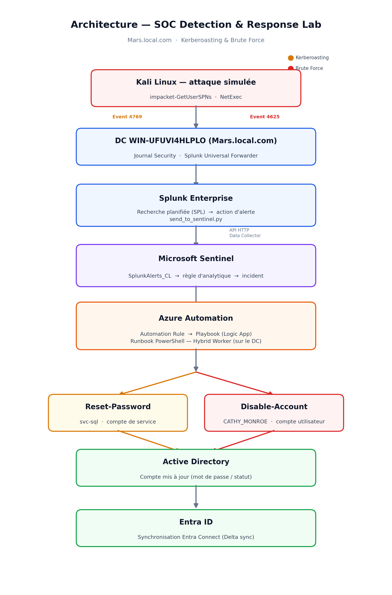

# 🛡️ Projet SOC — Détection & Réponse automatisée

## Ce que c’est et pourquoi

Un lab SOC construit de bout en bout autour de deux techniques réelles de **Credential Access** : **Brute Force** et **Kerberoasting**. Les attaques sont simulées dans un environnement Active Directory, détectées à partir des logs Windows avec Splunk, puis remontées vers Microsoft Sentinel pour déclencher automatiquement la remédiation.

L’objectif n’est pas simplement de reproduire une attaque, mais de démontrer une **chaîne SOC complète**, de la télémétrie jusqu’à la réponse.

---

## 🗺️ Architecture



La particularité du lab est la **séparation des rôles** : Splunk détecte, Sentinel orchestre et Azure Automation exécute la réponse directement sur l’infrastructure AD.

```
Attaque → Splunk (détection) → SplunkAlerts_CL → Incident Sentinel → Playbook → Hybrid Worker → Remédiation AD
```

---

## 🧰 Stack technique

| Technologie | Rôle |
|-------------|------|
| **Active Directory** | Infrastructure cible et télémétrie Windows |
| **Splunk** | Détection et corrélation des événements |
| **Microsoft Sentinel** | Gestion des incidents et orchestration SOAR |
| **Azure Automation** | Exécution automatisée de la remédiation |
| **Hybrid Runbook Worker** | Exécution des actions sur l’AD on-premise |
| **PowerShell** | Automatisation et remédiation AD |
| **NetExec / Impacket** | Simulation des attaques |
| **Entra ID / Entra Connect** | Synchronisation de l’identité hybride |

---

## 🎯 Ce que ça démontre

- **Détection basée sur les logs Windows :** identification de comportements suspects à partir des événements de sécurité Active Directory.
- **Corrélation cross-plateforme :** une alerte détectée dans Splunk traverse une chaîne complète jusqu’à Microsoft Sentinel.
- **SOAR / réponse automatisée :** l’incident déclenche un playbook puis un runbook exécuté sur le DC via Hybrid Worker.
- **Gestion du risque :** la réponse dépend du contexte. Un compte utilisateur compromis peut être désactivé, alors qu’un compte de service critique peut nécessiter une rotation de mot de passe pour éviter une interruption applicative.
- **Traçabilité :** chaque étape laisse une preuve exploitable — événement Windows, alerte Splunk, incident Sentinel, exécution du playbook et action AD.

---

## 🔎 Les deux scénarios

| Scénario | Signal principal | Réponse | Documentation |
|----------|------------------|---------|---------------|
| **Brute Force** | Event **4625** — échecs d’authentification | Désactivation du compte compromis | [📄 Documentation Brute Force](./README-bruteforce.md) |
| **Kerberoasting** | Event **4769** — TGS en RC4 / `0x17` | Rotation du mot de passe du compte de service | [📄 Documentation Kerberoasting](./README-kerberoasting.md) |

Les deux scénarios utilisent la même chaîne générale **Détection → Sentinel → SOAR → Hybrid Worker**, mais avec une télémétrie et une stratégie de remédiation adaptées au contexte.

---

## 🧩 Les vrais obstacles

Le lab a également servi à documenter les problèmes rencontrés en conditions réelles : audit GPO qui écrase la configuration locale, parsing de logs français, incompatibilités d’outils Python, DNS, limites d’intégration Splunk/Sentinel, problèmes de Runtime PowerShell et fonctionnement du Hybrid Worker.

Ces difficultés ont été diagnostiquées et corrigées au fur et à mesure, plutôt que masquées derrière une démonstration « parfaite ».

---

## 📚 Documentation complète

- **[Brute Force](./README-bruteforce.md)** — de la génération des Event 4625 jusqu’à la désactivation automatique du compte.
- **[Kerberoasting](./KERBEROASTING.md)** — de la détection des TGS RC4 jusqu’à la rotation automatique du mot de passe du compte de service.
